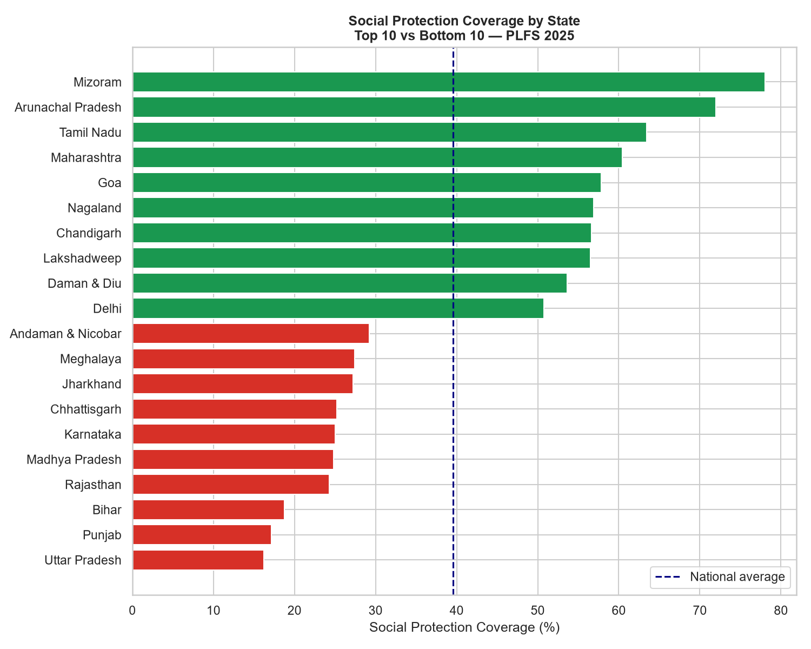
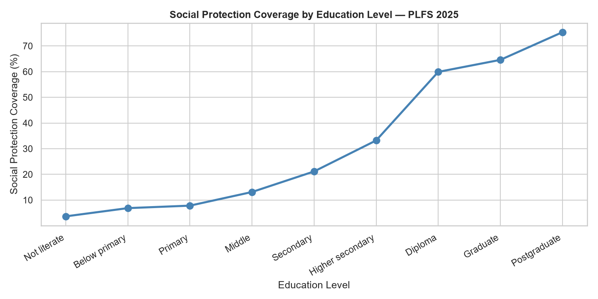
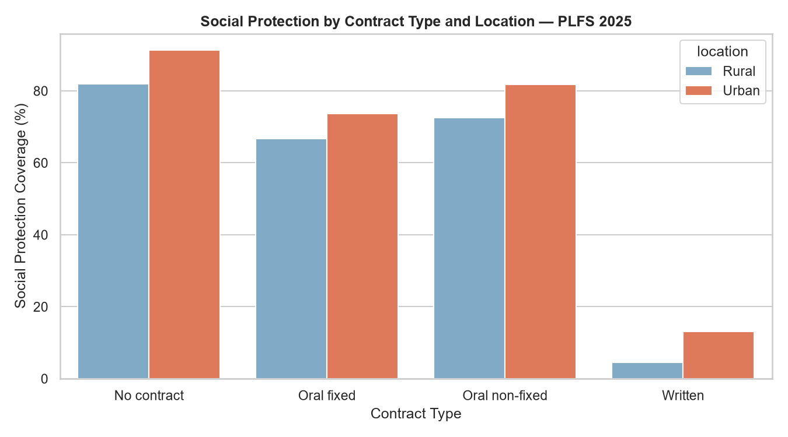

# Does-Formal-Employment-Translate-into-Social-Protection-Evidence-from-India-s-Labour-Market
Analyzed 1.15M+ Indian workers (PLFS 2025) using Stata, SQL Server, and Python to examine whether formal employment translates into social protection coverage — finding a fundamental disconnect between contractual formality and statutory benefits.
# Does Formal Employment Translate into Social Protection?
## Evidence from India's Labour Market — PLFS 2025

---

## Research Question
Are workers with formal employment arrangements actually more likely 
to receive social-security benefits and employment protections in India?

---

## Key Findings
- Only **29% of employed workers** have any social protection coverage
- Workers with **written contracts have lower coverage (6.5%)** than 
  workers with no contract (85%) — a paradox explained by enterprise 
  type composition
- **Urban workers are 2.3x more likely** to be covered than rural workers
- A near-perfect **education gradient**: illiterate workers 5% covered 
  vs postgraduates 75%
- **Mizoram vs Uttar Pradesh**: 78% vs 16% — a 5x regional gap
- Written contracts remain **negatively associated** with social protection 
  even after full controls (logit coef. = −2.66, p<0.001)

---

## Data
| Source | PLFS 2025 — Periodic Labour Force Survey |
|--------|------------------------------------------|
| Agency | MoSPI / National Sample Survey Office |
| Unit | Person-level (`cperv12025`) |
| Observations | 1,148,634 persons |
| Workers analyzed | 460,857 |

---

## Tools
| Tool | Purpose |
|------|---------|
| **Stata** | Data cleaning, cross-tabulations, survey-weighted logistic regression |
| **SQL Server** | Aggregation, filtering, state-level JOIN analysis |
| **Python** | Data visualization (pandas, matplotlib, seaborn) |

---

## Methodology
- Defined formal employment using `job_pas` (type of job contract) 
  and `etyp_pas` (enterprise type)
- Defined social protection using `ssec_pas` (social security benefits)
- Survey-weighted logistic regression using `svyset` in Stata with 
  proper PSU and strata specification
- Controlled for education, age, gender, location, and enterprise type

---

## Visualizations
### Social Protection by State


### Education Gradient


### Contract Type by Location


---
## Repository Structure

```text
plfs-social-protection-india/
│
├── stata/
│   └── plfs_analysis.do
│
├── sql/
│   └── plfs_queries.sql
│
├── python/
│   └── plfs_visualizations.py
│
├── charts/
│   ├── chart1_states.png
│   ├── chart2_education.png
│   └── chart3_contract_urban.png
│
├── data/
│   └── README.md
│
└── README.md


